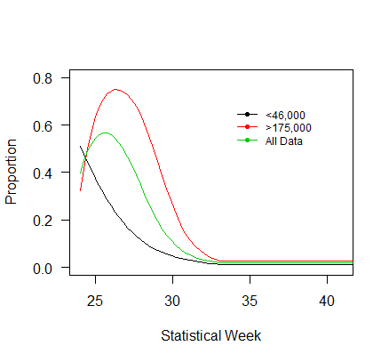
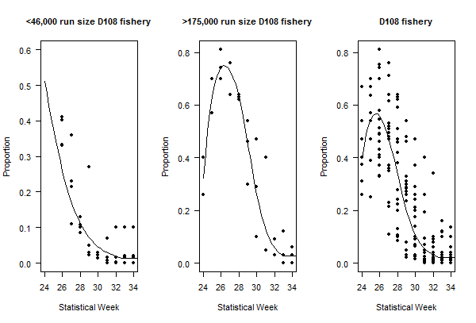
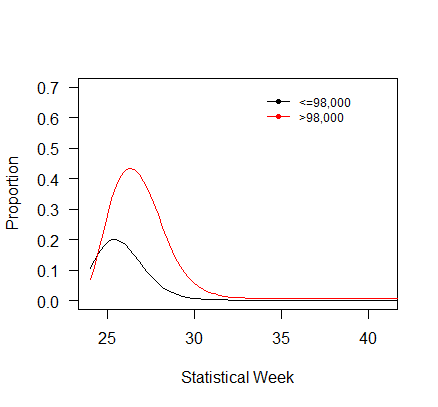
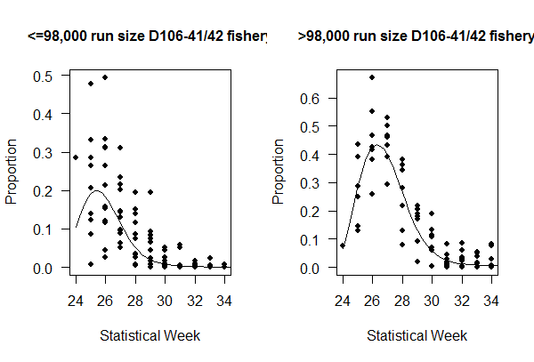
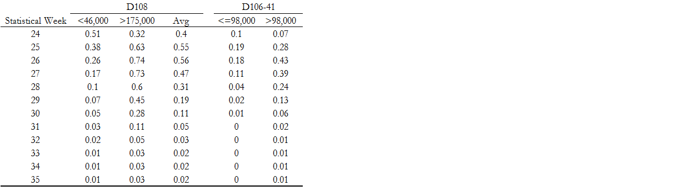
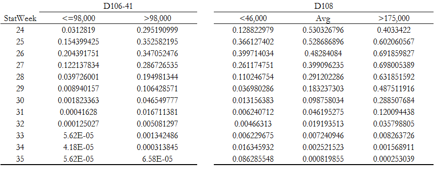

```{r load, echo=FALSE}
library(knitr)
library(pander)
library(tidyverse)
library(lubridate)
```
# Background
The trigger run sizes on the Scform sheet of the SFMM (Catch-CPUE) model were updated for the Tah for the Tahltan stock in the D-10641 and D-108 fishery.


**Prior results (used in models from 2014-2016)**
Data used from 1994 through 2013.Data through 2011 is SPA and data from 2012 on is GSI.







**Current results (used in models from 2017)**



